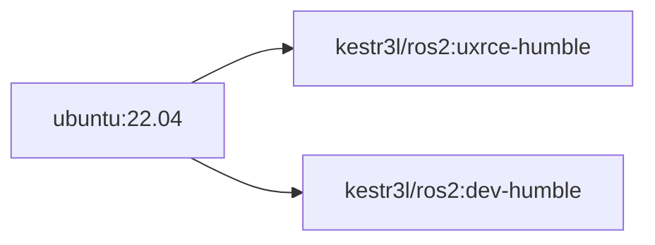

# CONTAINERIZED ROS2 FOR PX4 SITL

## 0. OVERVIEW

- Further documentation will be done.

## 1. AVAIABLE TAGS & BUILD ORDERS

### 1.1. TAG NAMEING RULES

|TAG|DESCRIPTION|Misc.|
|:-|:-|:-|
|`dev-<version>`|ROS2 Container with PX4 msg. definition|-|
|`uxrce-<version>`|ROS2 Container with PX4 msg. definition and uXRCE DDS Agent|-|

### 1.2. IMAGE AVAILABILITY

|TAG|ARCH|AVAILABILITY|Misc.|
|:-|:-|:-:|:-|
|`dev-humble`|AMD64|✅|-|
|`uxrce-humble`|AMD64|✅|-|

### 1.3. BUILD ORDERS



## 2. ENVIRONMENT VARIABLE SETUPS

- TBD

## 3. HOW-TO-BUILD

### 3.1. `ketr3l/ros2:dev-humble`

```shell
DOCKER_BUILDKIT=1 docker build \
--build-arg BASEIMAGE=ubuntu \
--build-arg BASETAG=22.04 \
-t kestr3l/ros2:dev-humble \
-f ./dev/Dockerfile ./dev
```

### 3.2. `ketr3l/ros2:uxrce-humble`

```shell
DOCKER_BUILDKIT=1 docker build \
--build-arg BASEIMAGE=ubuntu \
--build-arg BASETAG=22.04 \
-t kestr3l/ros2:uxrce-humble \
-f ./uXRCE-DDS/Dockerfile ./uXRCE-DDS
```

## 4. ATTACHING CONTAINER TO SITL

- TBD